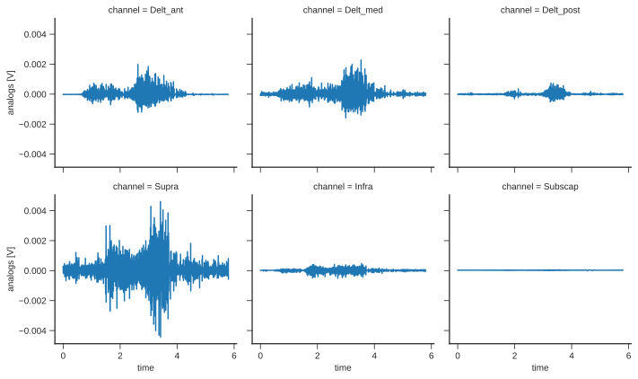
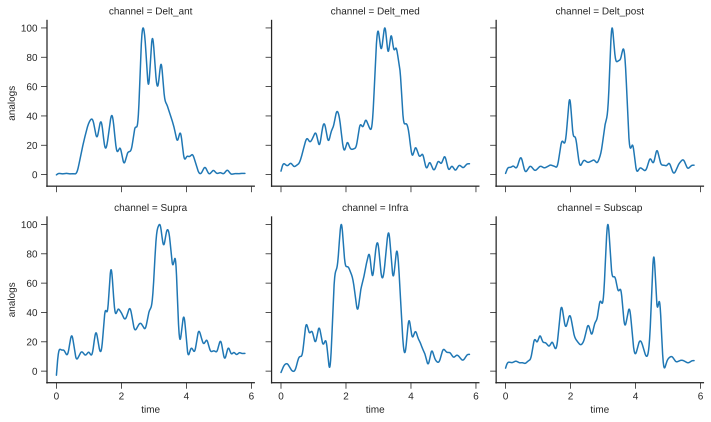
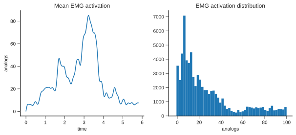

<p align="center">
    
  <a href="https://doi.org/10.21105/joss.02431"
    ></a>
  <a href="https://github.com/pyomeca/pyomeca/actions"
    ></a>
  <a href="https://coveralls.io/github/pyomeca/pyomeca?branch=master"
    ></a>
  <a href="https://anaconda.org/conda-forge/pyomeca"
    ></a>
  <a href="https://anaconda.org/conda-forge/pyomeca"
    ></a>
</p>

Pyomeca is a python library allowing you to carry out a complete biomechanical analysis; in a simple, logical and concise way.

## Pyomeca documentation

See Pyomeca's [documentation site](https://pyomeca.github.io).

## Example

Pyomeca implements specialized functionalities commonly used in biomechanics.
As an example, let's process the electromyographic data contained in this [`c3d file`](https://github.com/pyomeca/pyomeca/blob/master/tests/data/markers_analogs.c3d).

You can follow along without installing anything by using our binder server: [](https://mybinder.org/v2/gh/pyomeca/pyomeca/master?filepath=notebooks)

```python
from pyomeca import Analogs

data_path = "../tests/data/markers_analogs.c3d"
muscles = [
    "Delt_ant",
    "Delt_med",
    "Delt_post",
    "Supra",
    "Infra",
    "Subscap",
]
emg = Analogs.from_c3d(data_path, suffix_delimiter=".", usecols=muscles)
emg.plot(x="time", col="channel", col_wrap=3)
```



```python
emg_processed = (
    emg.meca.band_pass(order=2, cutoff=[10, 425])
    .meca.center()
    .meca.abs()
    .meca.low_pass(order=4, cutoff=5, freq=emg.rate)
    .meca.normalize()
)

emg_processed.plot(x="time", col="channel", col_wrap=3)
```



```python
import matplotlib.pyplot as plt

fig, axes = plt.subplots(ncols=2, figsize=(10, 4))

emg_processed.mean("channel").plot(ax=axes[0])
axes[0].set_title("Mean EMG activation")

emg_processed.plot.hist(ax=axes[1], bins=50)
axes[1].set_title("EMG activation distribution")
```



See [the documentation](https://pyomeca.github.io) for more details and examples.

## Features

- Signal processing routine commonly used in biomechanics such as filters, normalization, onset detection, outliers detection, derivatives, etc.
- Common matrix manipulation routines implemented such as getting Euler angles to/from a rototranslation matrix, creating a system of axes, setting a rotation or translation, transpose or inverse, etc.
- Easy reading and writing interface to common files in biomechanics (`c3d`, `csv`, `xlsx`,`mat`, `trc`, `sto`, `mot`)
- All of [xarray](http://xarray.pydata.org/en/stable/index.html)'s awesome features

The following illustration shows all of pyomeca's public API.
An interactive version is available in the [documentation](https://pyomeca.github.io/overview/).

<p align="center">
    
</p>

## Installation

Pyomeca itself is a pure Python package, but its dependencies are not.
The easiest way to get everything installed is to use [conda](https://conda.io/en/latest/miniconda.html).

To install pyomeca with its recommended dependencies using the conda command line tool:

```bash
conda install -c conda-forge pyomeca
```

Now that you have installed pyomeca, you should be able to import it:

```python
import pyomeca
```

## Integration with other modules

Pyomeca is designed to work well with other libraries that we have developed:

- [pyosim](https://github.com/pyomeca/pyosim): interface between [OpenSim](http://opensim.stanford.edu/) and pyomeca to perform batch musculoskeletal analyses
- [ezc3d](https://github.com/pyomeca/ezc3d): Easy to use C3D reader/writer in C++, Python and Matlab
- [biorbd](https://github.com/pyomeca/biorbd): C++ interface and add-ons to the Rigid Body Dynamics Library, with Python and Matlab binders.

## Bug reports & questions

Pyomeca is Apache-licensed and the source code is available on [GitHub](https://github.com/pyomeca/pyomeca).
If any questions or issues come up as you use pyomeca, please get in touch via [GitHub issues](https://github.com/pyomeca/pyomeca/issues).
We welcome any input, feedback, bug reports, and contributions.

## Citing Pyomeca

[](https://doi.org/10.21105/joss.02431)

If you use pyomeca in your academic work, please consider citing [our paper](https://doi.org/10.21105/joss.02431) as:

```bibtex
@article{Martinez2020,
  doi = {10.21105/joss.02431},
  url = {https://doi.org/10.21105/joss.02431},
  year = {2020},
  publisher = {The Open Journal},
  volume = {5},
  number = {53},
  pages = {2431},
  author = {Romain Martinez and Benjamin Michaud and Mickael Begon},
  title = {`pyomeca`: An Open-Source Framework for Biomechanical Analysis},
  journal = {Journal of Open Source Software}
}
```

Please consider citing the [xarray](https://openresearchsoftware.metajnl.com/articles/10.5334/jors.148/) project, which pyomeca is based on:

```bibtex
@article{jors-xarray,
title = {Xarray: N-D labeled arrays and datasets in Python},
author = {Joe Hamman and Stephan Hoyer},
year = {2017},
journal = {Journal of Open Research Software}
}
```

## Contributors

- [Romain Martinez](https://github.com/romainmartinez)
- [Benjamin Michaud](https://github.com/pariterre)
- [Mickael Begon](https://github.com/mickaelbegon)
- [Jenn Dowling-Medley](https://github.com/jdowlingmedley)
- [Ariane Dang](https://github.com/Dangzilla)

Pyomeca is an open-source project created and supported by the [S2M lab](https://www.facebook.com/s2mlab/).
